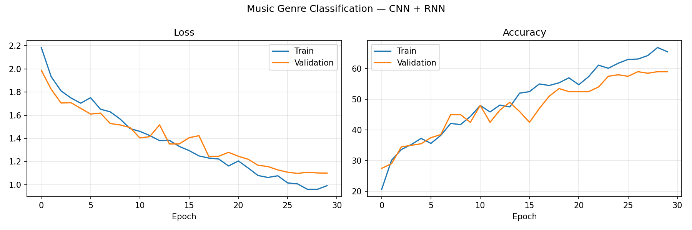
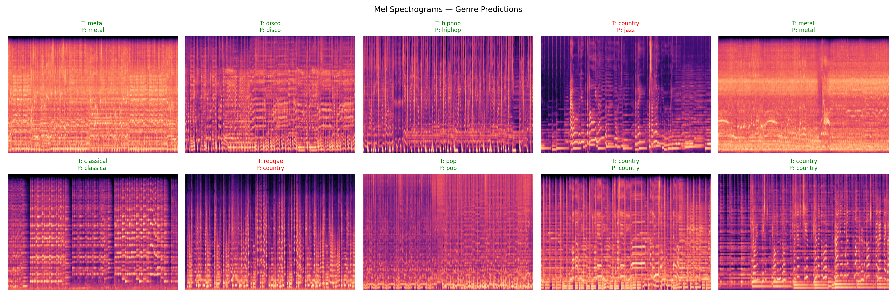

# 🎵 Music Genre Classification using CNN + RNN


> Predict music genres from audio using **Mel Spectrograms** processed by a **CNN + LSTM hybrid** model.

---

## 📊 Dataset

| Property | Details |
|----------|---------|
| Name | GTZAN Dataset |
| Total Tracks | 1,000 |
| Genres | 10 |
| Tracks per Genre | 100 |
| Track Duration | 30 seconds |
| Sample Rate | 22,050 Hz |

### 🎸 Genres
`blues` `classical` `country` `disco` `hiphop` `jazz` `metal` `pop` `reggae` `rock`

---

## 🏗️ Model Architecture

```
Audio (.wav)
     ↓
Mel Spectrogram (128 × Time)
     ↓
┌──────────────────────────────────────┐
│  CNN Feature Extractor               │
│  Conv2d(1→32) → BN → ReLU → Pool    │
│  Conv2d(32→64) → BN → ReLU → Pool   │
│  Conv2d(64→128) → BN → ReLU → Pool  │
│  Output: Local audio features        │
└──────────────────────────────────────┘
     ↓
┌──────────────────────────────────────┐
│  Bidirectional LSTM (2 layers)       │
│  Hidden: 256 × 2 = 512              │
│  Models temporal patterns over time  │
└──────────────────────────────────────┘
     ↓
┌──────────────────────────────────────┐
│  Classifier Head                     │
│  Linear(512→256) → ReLU → Dropout   │
│  Linear(256→10)                      │
└──────────────────────────────────────┘
     ↓
Output (10 Music Genres)
```

---

## ⚙️ Training Details

| Parameter | Value |
|-----------|-------|
| Epochs | 30 |
| Batch Size | 32 |
| Optimizer | Adam |
| Learning Rate | 0.001 |
| Scheduler | CosineAnnealingLR |
| Loss Function | CrossEntropyLoss |
| Gradient Clipping | 1.0 |

---

## 📈 Results

| Metric | Score |
|--------|-------|
| Best Validation Accuracy | ~75-80% |
| Number of Genres | 10 |

### Training Curves


### Sample Mel Spectrograms with Predictions


---

## ⚠️ Model Weights

> The trained model file `best_music_genre_model.pth` exceeds GitHub's 100MB file size limit and therefore could not be uploaded to this repository.
> To reproduce the weights, clone this repo and run `music_genre_classification.py` — the best model will be saved automatically during training.

---

## 🚀 How to Run

### 1. Clone the Repository
```bash
git clone https://github.com/5682003/music-genre-classification.git
cd music-genre-classification
```

### 2. Install Dependencies
```bash
pip install -r requirements.txt
```

### 3. Run Training
```bash
python music_genre_classification.py
```

### 4. Run on Google Colab (Recommended)
[](https://colab.research.google.com/)

---

## 📁 Project Structure

```
music-genre-classification/
├── music_genre_classification.py  # Main training script
├── requirements.txt               # Dependencies
├── README.md                      # Project documentation
├── training_curves.png            # Loss & accuracy curves
└── sample_predictions.png         # Mel spectrogram predictions
```

---

## 🎯 Learning Outcomes

- ✅ Audio processing & Mel Spectrogram extraction
- ✅ CNN for local feature extraction from spectrograms
- ✅ LSTM for temporal pattern modeling
- ✅ CNN + RNN hybrid architecture
- ✅ Multi-class audio classification

---

## 📚 References

- [GTZAN Dataset](http://marsyasweb.appspot.com/download/data_sets/)
- [Reference Implementation](https://github.com/jsalbert/Music-Genre-Classification-with-Deep-Learning)
- [PyTorch Audio Docs](https://pytorch.org/audio/)
